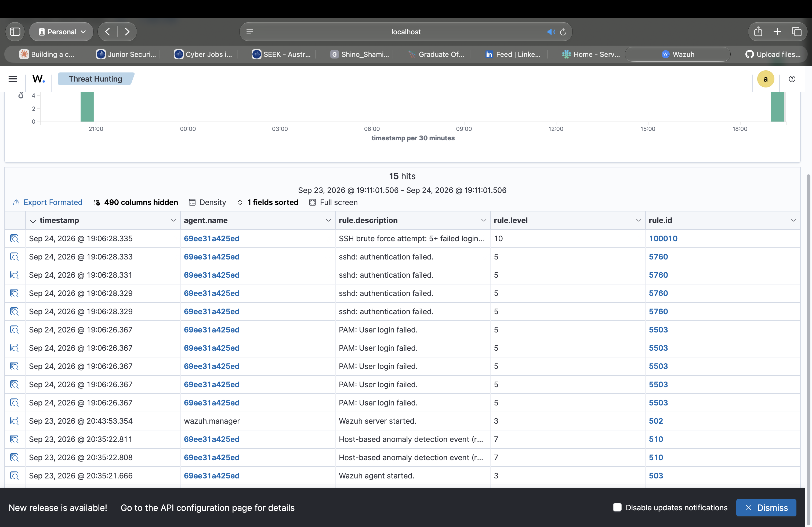

# SSH Brute Force Detection — Sigma Rule + Wazuh (Self-Built Lab)

## What this project is

A hands-on detection engineering project: write a vendor-neutral Sigma rule for a real attack behaviour, convert it to a working query, implement the actual alerting logic in a SIEM, deploy it, prove it fires against real attacker traffic, then find and fix a false positive in my own rule.

This isn't a simulated "textbook" detection — the whole environment is self-built and self-attacked: a Kali Linux container brute-forcing SSH against a target container, with Wazuh watching and alerting on it.

## Why Wazuh instead of a cloud SIEM

This project originally targeted Microsoft Sentinel, since that's the SIEM I've used in my other labs (real Azure-hosted attack data caught on an internet-exposed VM). I switched to **Wazuh** (free, self-hosted, runs locally via Docker) for this project so it:
- Costs nothing to run or leave set up
- Is fully reproducible by anyone cloning this repo — no cloud account or workspace required
- Still demonstrates the same core skill: writing Sigma, converting it, proving it fires, tuning it

## Architecture

- **Wazuh stack** (manager, indexer, dashboard) — Docker Compose, single-node, v4.9.2
- **`target` container** — Ubuntu 22.04 with SSH enabled, running a Wazuh agent, monitoring `/var/log/auth.log`
- **`attacker` container** — Kali Linux, running Hydra against the target's SSH service
- All three networked together via Docker, so the whole environment is fully self-contained and reproducible

## Status: Complete — detection built, fired, and tuned 

- [x] Docker Desktop installed and running (Mac, Apple Silicon)
- [x] Wazuh single-node stack deployed via Docker Compose
- [x] Resolved a chain of SSL/certificate issues in Wazuh's Docker cert generation process (see notes below)
- [x] Target (Ubuntu + SSH) and attacker (Kali + Hydra) containers built and networked
- [x] Wazuh agent installed on target, enrolled, configured to monitor `/var/log/auth.log`
- [x] Confirmed Wazuh's built-in rule (5760, "sshd: authentication failed") correctly catches individual failed logins
- [x] Wrote a Sigma rule for the base "single failed SSH password" detection (`ssh_failed_password.yml`)
- [x] Converted the Sigma rule to a working Lucene query using `sigma-cli` + the `elasticsearch` backend plugin
- [x] Hit a genuine technical limitation: modern Sigma correlation syntax (`count() by ... > N`) can't be converted directly into a query — that kind of stateful, time-windowed logic has to live in the SIEM's own rule engine, not a search query
- [x] Implemented the actual threshold logic as a custom Wazuh rule using native `frequency`/`timeframe` correlation
- [x] Fired Hydra for real, confirmed the custom rule (ID 100010) correctly triggers a high-severity alert off 5+ failed logins in 5 minutes
- [x] **Found and fixed a false positive in my own rule**: the first version of rule 100010 counted 5 failed logins *per agent*, not *per source IP* — meaning 5 different legitimate users mistyping their password from 5 different machines within the same 5-minute window would have falsely triggered a "brute force" alert. Added `<same_source_ip/>` to scope the correlation correctly to a single attacking source.

## The Sigma rule

```yaml
title: SSH Failed Password Attempt
id: 8b3f4c92-6d1a-4e5f-9c2b-7a8e1f3d5c6b
status: experimental
description: Detects a single failed SSH password authentication attempt
author: Shino Shamit
date: 2026-09-21
logsource:
  product: linux
  service: sshd
detection:
  selection:
    full_log|contains: 'Failed password'
  condition: selection
level: low
tags:
  - attack.credential_access
  - attack.t1110.001
```

Converted to a Lucene query with:
```
sigma convert -t lucene --without-pipeline ssh_failed_password.yml
```

## Screenshots



*The Threat Hunting events table showing rule 100010 ("SSH brute force attempt: 5+ failed logins...") firing at level 10, with the five underlying `sshd: authentication failed` (5760) events beneath it. Save it into a `screenshots/` folder in the repo and update the path above to match.*

## The false positive, in detail

This is the part of the project I'm most glad I caught, because it's exactly the kind of thing a "just copy the rule and ship it" approach misses.

**First version of the custom Wazuh rule:**
```xml
<rule id="100010" level="10" frequency="5" timeframe="300">
  <if_matched_sid>5760</if_matched_sid>
  <description>SSH brute force attempt: 5+ failed logins from same source within 5 minutes</description>
</rule>
```

This fired correctly in testing — but only because every failed login in my test happened to come from the same Kali container. Reading the rule more carefully, `frequency`/`timeframe` on its own counts matches of the referenced rule (5760) **per agent**, not per source IP. Five unrelated failed logins from five different IPs, on the same monitored host, within 5 minutes, would have triggered the same "brute force" alert — a false positive that would generate noise and erode trust in the detection.

**Fix:**
```xml
<rule id="100010" level="10" frequency="5" timeframe="300">
  <if_matched_sid>5760</if_matched_sid>
  <same_source_ip />
  <description>SSH brute force attempt: 5+ failed logins from same source within 5 minutes</description>
  <mitre>
    <id>T1110.001</id>
  </mitre>
  <group>authentication_failures,</group>
</rule>
```

Adding `<same_source_ip/>` scopes the count to failures from one specific source IP, which is what "brute force from an attacker" actually means.

## Notable infrastructure troubleshooting

Getting the Wazuh Docker stack stable took real debugging, not just following a tutorial:

- **Missing `vm.max_map_count`** — OpenSearch (which the Wazuh indexer runs on) needs a higher memory-mapped area limit than Docker's Mac VM ships with by default. Without it, the indexer crashes on startup with `IllegalStateException: failed to load plugin class`.
- **Cert generation on Apple Silicon** — the common `justincormack/nsenter1` fix for the above doesn't run properly on ARM (`execve: No such file or directory`); swapped to an Alpine + `nsenter` one-liner instead.
- **Directories instead of files** — Docker silently creates empty directories at any bind-mount path that doesn't exist yet, rather than erroring. This happened repeatedly during cert generation, crashing the indexer (`Is a directory: ...wazuh.indexer.pem Expected a file`), the dashboard (`EACCES: permission denied, open '...root-ca.pem'`), and the manager's Filebeat (`error initializing publisher: read /etc/ssl/root-ca.pem: is a directory`), until every cert path was confirmed to be a real file with correct permissions.
- **`root-ca-manager.pem`/`.key`** — the single-node cert generator fails to produce these two files due to a permissions quirk, but the manager's Filebeat config still expects them. Fixed by copying the root CA cert/key into place under the expected filename.
- **Agent version mismatch** — installing the Wazuh agent via the default package repo grabs the latest version (4.14.7), which a 4.9.2 manager refuses to enroll (`Agent version must be lower or equal to manager version`). Had to pin the agent install to match the manager's version.
- **Log source not configured** — the agent was connected and healthy for a while before I realised it was never actually told to monitor `/var/log/auth.log` — being connected and being configured to watch a specific file are two separate things. Added the missing `<localfile>` block.
- **Manually-started services don't survive container restarts** — `sshd` and `rsyslogd` were started manually inside the target container rather than being part of its init process, so every time Docker restarted the container (Mac sleep, Docker Desktop restart, etc.), both silently died and had to be restarted by hand before the pipeline worked again.

## Tech stack

- Wazuh 4.9.2 (manager, indexer, dashboard) — Docker Compose, single-node
- Sigma / sigma-cli (with the `elasticsearch` backend plugin) for vendor-neutral detection rule authoring and Lucene conversion
- Custom Wazuh XML rule (`local_rules.xml`) for stateful correlation logic
- Kali Linux (Hydra) as the attacker, Ubuntu 22.04 as the target — both Docker containers
- Docker Desktop on macOS (Apple Silicon, running amd64 images under emulation)
